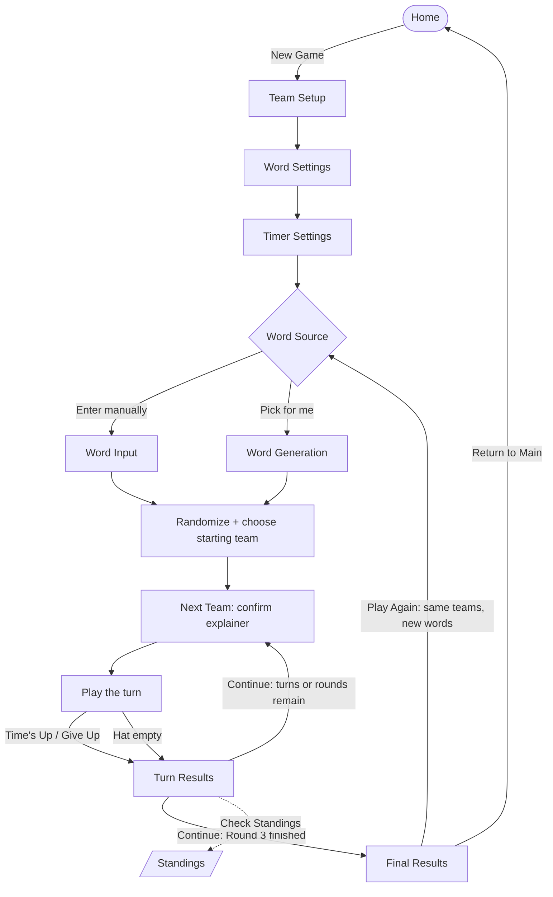

# Game Flow

This page traces a game from launch to final results. It describes the pass-and-play flow; the [online and nearby modes](play-modes.md) replace the on-device setup with a lobby but reach the same gameplay loop.

## The whole flow

## The setup leg

A new game walks through the setup screens once, in order:

| Screen | Purpose |
|---|---|
| Team Setup | Create 2–6 teams and their players. |
| Word Settings | Set how many words each player adds. |
| Timer Settings | Set the turn length and whether skipping is allowed. |
| Word Source | Choose manual entry or automatic word generation. |
| Word Input *or* Word Generation | Fill the hat — players type their words, or the app generates them. |
| Randomization | Shuffle the words and pick the starting team. |

See [Setup](setup.md) for the details of each step.

## The gameplay loop

After setup, the game repeats a three-screen cycle:

1. **Next Team** — announces the team that is up and (on the team's first turn) lets you choose its explainer. On later turns it confirms the auto-rotated explainer.
2. **Play** — the timed turn itself. See [A Turn](turn.md).
3. **Turn Results** — what the team guessed this turn, with **Check Standings** and **Continue**.

**Continue** decides where the loop goes next, and this is also where the [round system](rounds.md) lives:

- If the hat still has words, the **next team** is up (same round).
- If a turn just **emptied the hat** and rounds remain, the next team up is the start of the **next round** (with the same words and a stricter rule).
- If the **third round** just ended, the game goes to **Final Results** instead of looping.

So the single Next Team → Play → Turn Results cycle carries the whole game — all three rounds and every team's turns — until the final round's hat is empty.

## The end

**Final Results** shows the total scores and the winner. From there, **Play Again** keeps the teams and loops back to collect new words, while **Return to Main** ends the game. See [Scoring and Winning](scoring.md).

## See also

- [Setup](setup.md)
- [A Turn](turn.md)
- [The Three Rounds](rounds.md)
- [Play Modes](play-modes.md)
